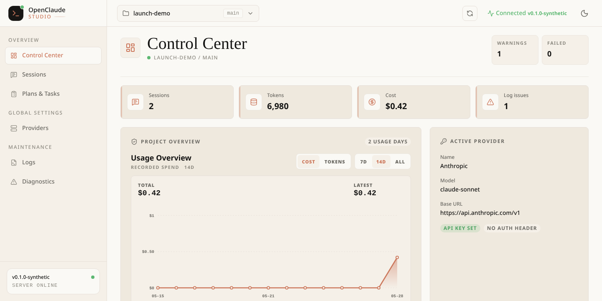
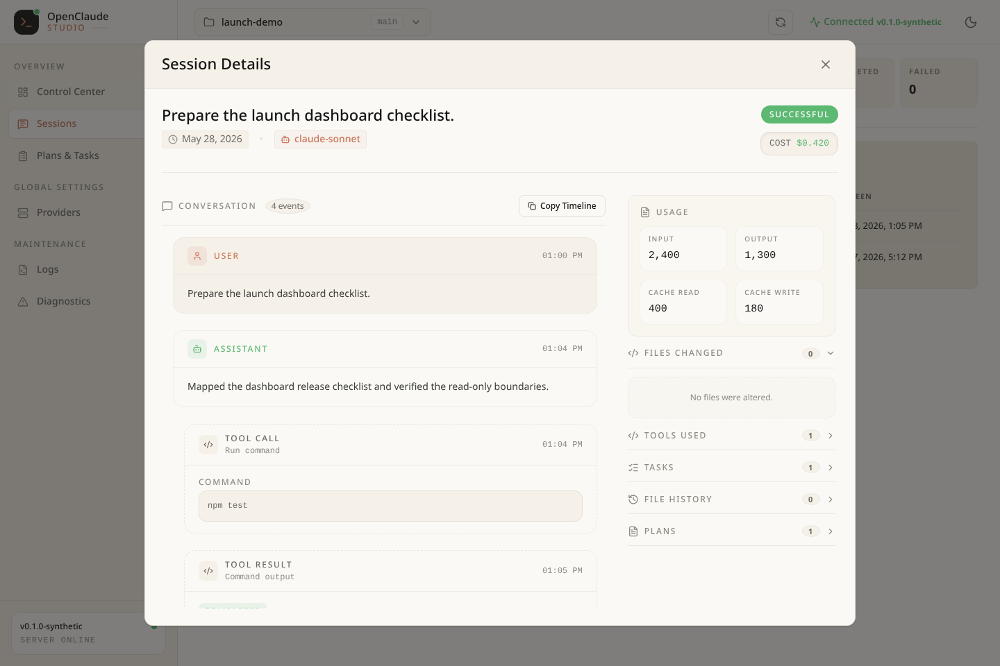
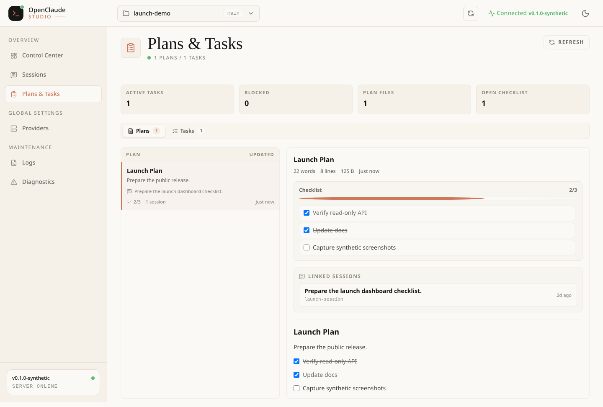
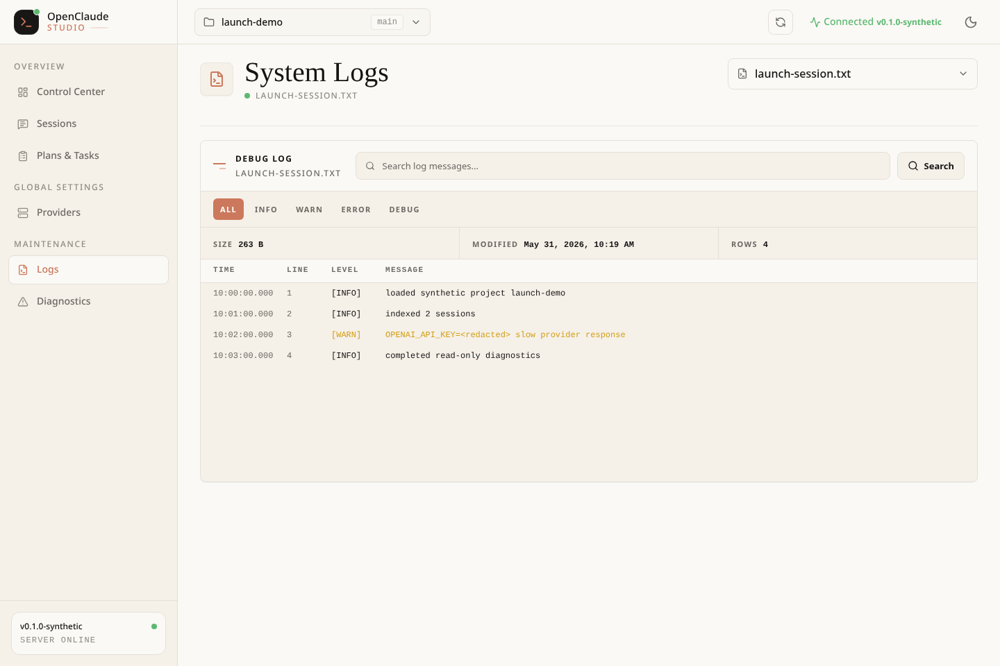

# OpenClaude Studio

[](https://github.com/chioarub/openclaude-studio/actions/workflows/ci.yml)
[](https://github.com/chioarub/openclaude-studio/actions/workflows/release.yml)
[](https://www.npmjs.com/package/openclaude-studio)
[](LICENSE)

OpenClaude Studio is a read-only companion dashboard for OpenClaude. Run a small local API on your machine, open the hosted web app, and inspect projects, sessions, plans, tasks, providers, diagnostics, usage, and debug logs without editing local OpenClaude data.

The project is intentionally scoped around a small read-only foundation: a hosted or local web app talks to a local server running on your machine. The server reads OpenClaude files from disk, redacts likely secrets, and exposes only read-only HTTP endpoints.

OpenClaude Studio is an independent community companion dashboard for OpenClaude. It is not affiliated with, endorsed by, or sponsored by Anthropic.

## Why OpenClaude Studio?

OpenClaude keeps useful local context in files that are awkward to inspect by hand. Studio gives that data a safer dashboard surface:

- See which OpenClaude projects were active recently.
- Inspect sessions, assistant messages, tool calls, tool results, errors, changed files, usage, and cost.
- Review linked plans, linked tasks, and checklist progress without opening raw task files.
- Search project-scoped debug logs without opening raw log files.
- Check active provider status while keeping secret fields redacted.
- Diagnose missing, malformed, or unavailable local data.

## Current Scope

The current MVP line includes:

- Project selector backed by `~/.openclaude.json`
- Project overview with recent sessions, usage chart, log issue counts, and provider status
- Session list and rich session inspector
- Conversation timeline with user messages, assistant messages, tool calls, tool results, and errors
- Changed files, token usage, cost summary, linked plans, linked tasks, and file-history context for sessions
- Plans & Tasks view with checklist progress, linked sessions, task status groups, and detail panes
- Active provider inspection with secret fields redacted
- Project-scoped diagnostics
- Project-scoped debug log viewing, filtering, search, virtualized scrolling, and copy-to-clipboard for log messages
- Dark and light themes
- Visible local API URL control for custom local server ports
- Read-only local API with no write endpoints

It does not currently edit OpenClaude settings, provider profiles, sessions, logs, project files, tasks, or plans.

## Screenshots

Screenshots use synthetic fixture data only.









## How It Works

```text
Browser UI
  |
  | HTTP JSON
  v
Local server on 127.0.0.1:43110
  |
  | read-only file access
  v
~/.openclaude.json
~/.openclaude/projects/
~/.openclaude/plans/
~/.openclaude/tasks/
~/.openclaude/debug/
<project>/.openclaude/file-history/
```

The web UI can run locally during development or be hosted as static assets. The server should run on the same machine as OpenClaude because it reads local OpenClaude files.

## Privacy At A Glance

- The local API binds to `127.0.0.1` by default.
- The API is read-only and has no write endpoints in the current MVP line.
- The hosted web app runs in your browser and talks to your local server.
- The app code does not intentionally collect telemetry; review your own hosting configuration if you deploy a fork.
- Redaction is defense in depth, not a guarantee for every possible secret format.
- Review logs, screenshots, and recordings before sharing them publicly.

## Requirements

- Node.js 22 or newer
- npm
- OpenClaude installed and used at least once, so local config/session files exist

The supported runtime floor is Node.js 22. CI and release jobs use Node.js 22 so local development, validation, and publishing exercise the same supported baseline. The repository includes [`.nvmrc`](.nvmrc) for contributors who use nvm-compatible tooling.

## Quick Start

1. Start the local read-only API:

```bash
npx openclaude-studio
```

2. Open the hosted dashboard:

```text
https://openclaude-studio.pages.dev/
```

3. Keep the terminal running while you use the dashboard.

The browser UI connects to `http://127.0.0.1:43110` by default. If the local server is not running, the app will show the command above and the API URL it expected to reach. See [Troubleshooting](docs/troubleshooting.md) for common setup and connection issues.

## Local Development

Install dependencies:

```bash
npm install
```

Run the local server and web app:

```bash
npm run dev
```

Open the web UI at:

```text
http://127.0.0.1:5173
```

The local API listens at:

```text
http://127.0.0.1:43110
```

## Production-Style Local Run

Build all workspaces:

```bash
npm run build
```

Start the local API:

```bash
npm run start -w openclaude-studio
```

By default, the server binds to `127.0.0.1` and listens on port `43110`.

## Configuration

| Variable | Default | Description |
| --- | --- | --- |
| `OPENCLAUDE_STUDIO_HOST` | `127.0.0.1` | Host for the local API server. Keep this on loopback unless you provide your own trusted access control. |
| `OPENCLAUDE_STUDIO_PORT` | `43110` | Port for the local API server. |
| `OPENCLAUDE_STUDIO_ALLOWED_ORIGINS` | official hosted app plus loopback browser origins | Comma-separated additional hosted web origins allowed to call the local API. |
| `OPENCLAUDE_STUDIO_TOKEN` | unset | Optional API token for custom callers or deployments with their own access flow. The bundled web UI does not prompt for tokens. |
| `CLAUDE_CONFIG_DIR` | `~/.openclaude` | OpenClaude config directory override, useful for testing alternate local data roots. |

The official hosted app at `https://openclaude-studio.pages.dev` is allowed by default. If you host the web UI somewhere else, add that origin:

```bash
OPENCLAUDE_STUDIO_ALLOWED_ORIGINS=https://studio.example.com npm run start -w openclaude-studio
```

## Development

Useful commands:

```bash
npm run lint
npm test
npm run build
npm run smoke:package
npm run test:e2e
```

Workspace layout:

- `apps/server`: Fastify local API and CLI binary
- `apps/web`: Vite, React, Tailwind CSS dashboard
- `packages/shared`: API response types shared by server and web
- `tests/e2e`: Playwright coverage for the integrated app

Additional documentation:

- [Architecture](docs/architecture.md)
- [Local server](docs/local-server.md)
- [Troubleshooting](docs/troubleshooting.md)
- [Deployment](docs/deployment.md)
- [Privacy and redaction](docs/privacy-and-redaction.md)

## Safety Model

OpenClaude Studio is designed to be conservative by default:

- The current API is read-only.
- The server binds to loopback by default.
- Browser origins are restricted to loopback, the official hosted app, and any origins explicitly configured by the user.
- File reads are bounded.
- Symlink traversal is avoided for sensitive local file reads.
- Provider URLs, auth fields, bearer tokens, common API key formats, and log messages are redacted where possible.

Redaction is defense in depth, not a guarantee for every possible secret format. Avoid sharing screenshots or logs without reviewing them.

## Roadmap

The current release focuses on a useful read-only foundation. Future work will be prioritized by real user feedback. Valuable next areas include:

Shipped in the MVP line:

- [x] Hosted web dashboard
- [x] Installable local API package through npm
- [x] Project selector and project overview
- [x] Session summaries for the selected project
- [x] Rich session timeline with transcript, tool call, file change, usage, and error details
- [x] Plans and tasks views linked back to sessions
- [x] File history and backup context for selected sessions
- [x] Active provider inspection with secret fields redacted
- [x] Project-scoped diagnostics
- [x] Debug log viewing, filtering, search, virtualized scrolling, and log-message copy
- [x] Dark and light themes
- [x] Custom local API URL setting for non-default ports
- [x] Conservative read-only local API

Planned and open for discussion:

- [ ] Global project search across sessions, logs, config, prompt assets, plans, and tasks
- [ ] Broader file history and backup inspection across selected projects
- [ ] Config source explorer for user settings, project settings, local settings, and managed config
- [ ] Prompt asset inventory for instructions, agents, commands, workflows, and output styles
- [ ] Hooks and permissions diagnostics
- [ ] Provider profile management with safe templates and validation
- [ ] Live log streaming with pause, filtering, and retention controls
- [ ] Optional write workflows after the write model, review UX, backups, and security boundaries are designed explicitly

Ideas, bug reports, and focused pull requests are welcome. If you propose a write-capable feature, please include the expected safety model and rollback behavior.

## Contributing

Please read [CONTRIBUTING.md](CONTRIBUTING.md) before opening a pull request. Keep changes focused, include tests for behavior changes, and avoid committing local data, generated output, logs, secrets, or machine-specific paths.

## Security

Please read [SECURITY.md](SECURITY.md) for the local data access model and vulnerability reporting guidance.

## License

MIT. See [LICENSE](LICENSE).
